# HeatSentinel AI — System Design Specification

**Subtitle:** Autonomous Hyperlocal Heat Response Intelligence
**Hackathon:** FortyGuard Hackathon '26 (Agentic AI / Data Analysis & Correlation)
**Status:** Pre-implementation architecture. No application code or Antigravity prompts are included in this document.

---

## 1. Executive Architecture Summary

HeatSentinel AI is a **modular monolith** with a **deterministic analysis core** and a **thin agentic investigation layer** on top of it. In plain terms:

- FortyGuard gives us raw heat measurements for small patches of a city (max 10 mi² per call).
- A **Geospatial Engine** cuts the city into those patches (AOIs) and stitches results back together.
- A **Deterministic Analysis Engine** turns raw heat + census + resource data into numbers: exposure, anomaly, vulnerability, resource deficit, and a single **Response Gap** score per zone.
- An **Agent** (LLM) doesn't calculate anything. It looks at the deterministic numbers, decides *where* to look closer (which AOI to refine, which tool to call next), and then writes the human-readable explanation and recommendation once the numbers are final.
- A **Backend API** exposes one primary action — `RUN HEAT HUNT` — as an asynchronous, observable job, because FortyGuard itself is asynchronous and a full city scan takes multiple sequential/parallel calls.
- A **Frontend Command Center** visualizes the run in real time: map, priority ranking, evidence, and agent activity log.

The single sentence version: **FortyGuard supplies the eyes, the deterministic engine supplies the math, the agent supplies the judgment about where to look and how to explain it, and the UI supplies the situational picture.**

---

## 2. Design Goals

- Make FortyGuard hyperlocal heat data the central, non-optional data source.
- Produce a single, explainable, reproducible **Response Gap** ranking per run.
- Make the agent's investigation *real* — every claimed action corresponds to an actual tool call and a logged result.
- Keep all scoring math deterministic, versioned, and configurable (no opaque weights buried in code).
- Handle the 10 mi² FortyGuard tiling constraint as a first-class geospatial concern, transparent to every other component.
- Support graceful degradation: missing data is reported as missing, never fabricated.
- Ship a working, demoable Phoenix MVP in six days with a three-person team, with NYC as an optional non-blocking validation track.
- Keep the deployment footprint small enough that three people can operate it without dedicated DevOps effort.
- Guarantee a reliable demo path (Live / Cached / Demo modes) that cannot silently mislabel synthetic data as live data.

## 3. Non-Goals

- Not building a forecasting system (FortyGuard has no forecast data; none will be simulated).
- Not building a general-purpose GIS platform — only the AOIs, joins, and aggregations HeatSentinel needs.
- Not training or fine-tuning any ML model. All "intelligence" is either FortyGuard's native analytics, deterministic formulas, or LLM reasoning over structured data.
- Not building an official public-health index. Response Gap is explicitly a decision-support heuristic, not a medical/epidemiological instrument.
- Not building two separate applications for Phoenix and NYC — one reusable city-analysis pipeline, parameterized by city config.
- Not building microservices, Kubernetes, or multi-region infrastructure.
- Not exposing FortyGuard (or any other) API keys to the browser under any circumstance.
- Not letting the LLM perform arithmetic that feeds into the Response Gap score.

---

## 4. System Architecture (High-Level)

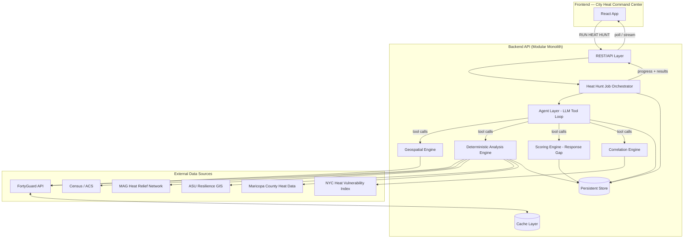

**Key architectural decision — modular monolith vs. microservices:** given a 6-day window and 3 engineers, a single deployable backend with clearly separated internal modules (see §5) is chosen over microservices. Microservices would add network boundaries, deployment complexity, and debugging overhead with no benefit at this scale. **Recommendation: modular monolith.**

---

## 5. Component Architecture

| Component | Responsibility | Owner |
|---|---|---|
| **API Layer** | HTTP endpoints, request validation, auth-free but key-protected, job kickoff | Backend |
| **Heat Hunt Orchestrator** | State machine driving a run through QUEUED → COMPLETED, sequencing agent + deterministic steps | Backend |
| **Agent Layer** | LLM tool-calling loop: decides *what* to investigate next, never computes scores | AI Engineer |
| **FortyGuard Client** | Single centralized service for submit/poll/normalize/cache against FortyGuard | Backend |
| **Geospatial Engine** | City boundary loading, AOI tiling (10 mi² constraint), polygon validation, spatial joins, point-in-polygon, distance/coverage calcs | Backend |
| **Deterministic Analysis Engine** | Converts normalized heat + external data into heat metrics, vulnerability, resource deficit | Backend |
| **Scoring Engine** | Config-driven Response Gap computation, ranking | Backend |
| **Correlation Engine** | Pearson/Spearman between heat exposure and vulnerability variables | Backend (Data Analysis track) |
| **Recommendation/Evidence Composer** | LLM-authored explanation and action text over structured evidence | AI Engineer |
| **Cache Layer** | Deduplicates identical FortyGuard requests | Backend |
| **Persistent Store** | Stores run history, metrics, evidence, recommendations | Backend |
| **Frontend Command Center** | Map, ranking panel, evidence panel, agent activity feed, Heat Hunt control | Frontend |

---

## 6. Data Flow (End-to-End)

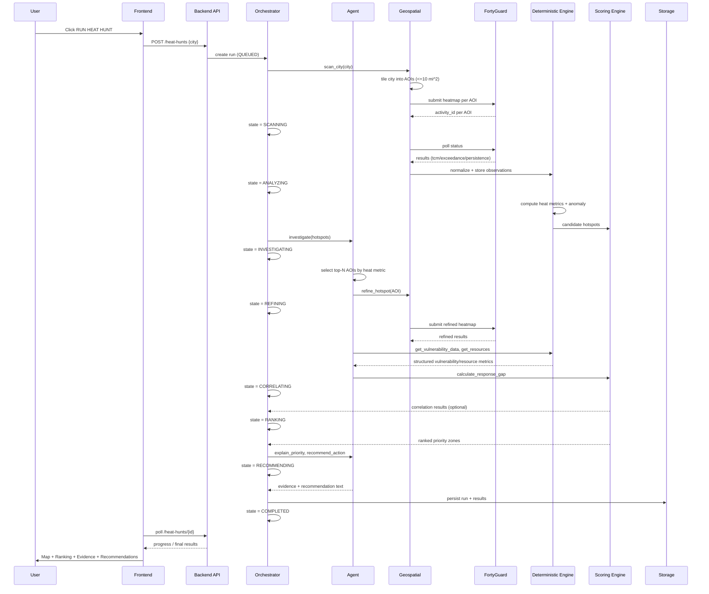

---

## 7. Agent Architecture

### 7.1 Design principle: **the LLM is not the calculator**

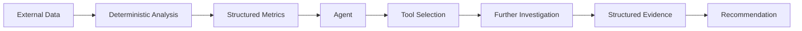

The agent receives **already-computed numbers** (heat metrics, vulnerability scores, resource deficits) as structured JSON. It never re-derives them. Its only jobs are: decide where to invest more FortyGuard calls, and turn final numbers into prose evidence + recommendation.

### 7.2 Agent loop

1. Receive coarse scan results (per-AOI heat metrics) from the Deterministic Engine.
2. Rank AOIs by a simple deterministic "candidate score" (already computed — the agent doesn't invent this ranking).
3. For the top-K candidates (config-driven, e.g. K=3–5 for a 6-day MVP), call `refine_hotspot`.
4. For each refined hotspot, call `get_vulnerability_data` and `get_resources`.
5. Call `calculate_risk_metrics` and `calculate_response_gap` (deterministic tools — the agent invokes them but does not perform the math itself).
6. Once Response Gap and rank are returned, call `explain_priority` (LLM-authored, grounded strictly in the structured evidence object) and `recommend_action`.
7. Every step logs an `AgentAction` record (tool name, input, output, timestamp, run correlation ID) so the frontend Agent Activity panel reflects **real** tool executions, not narrated fiction.

### 7.3 Agent state

The agent is **stateless between Heat Hunt runs** and **explicitly stateful within a run**, held by the Orchestrator (not the LLM's own memory) as a run object: `investigated_aois[]`, `pending_aois[]`, `evidence[]`, `current_phase`. This avoids relying on LLM context retention for anything that affects correctness — the orchestrator is the source of truth for what has and hasn't been investigated.

---

## 8. Required Agent Tools

| Tool | Purpose | Input | Output | Type | Failure Handling |
|---|---|---|---|---|---|
| `scan_city` | Kick off coarse tiled scan of the target city | `{city, analytic_type, granularity}` | `{aois: [{aoi_id, polygon, coarse_heat_metric}]}` | Deterministic (backend service; agent invokes it) | On partial AOI failure, return successful tiles + list of failed tiles; run continues in degraded mode |
| `query_fortyguard_heat` | Submit/poll a single FortyGuard heatmap request | `{polygon_aoi, start_date, start_time, analytic_type, granularity, threshold?, direction?}` | `{activity_id, status, normalized_result}` | Deterministic | Retry with backoff; on timeout, mark AOI `DATA_UNAVAILABLE`, never fabricate a value |
| `refine_hotspot` | Re-query a smaller/adjusted polygon around a candidate hotspot for a tighter AOI | `{parent_aoi_id, refinement_strategy}` | `{refined_aoi, heat_metric}` | Agent-selected, deterministically executed | If refined polygon invalid, fall back to parent AOI result and flag `refinement_skipped` |
| `get_vulnerability_data` | Fetch/normalize census & socioeconomic data for an AOI | `{aoi_id}` | `{elderly_pct, density, socio_index, ac_access_proxy, sources[]}` | Deterministic | Missing fields marked `null` + `missing_evidence: true`; never interpolated |
| `get_resources` | Fetch cooling centers / hydration / hospitals within/near an AOI | `{aoi_id, radius}` | `{resources: [{type, name, geometry, distance}]}` | Deterministic | Empty result is valid (means real resource desert); dataset fetch failure is flagged distinctly from "zero resources found" |
| `calculate_risk_metrics` | Compute exposure, anomaly, persistence/exceedance rollups per AOI | `{aoi_id, heat_observations}` | `{exposure, anomaly, persistence, exceedance}` | Deterministic only | Errors bubble as `metric_unavailable`, run continues for other AOIs |
| `calculate_response_gap` | Combine heat × vulnerability × resource deficit into Response Gap + rank | `{aoi_id, heat_metrics, vulnerability_score, resource_deficit}` | `{response_gap, rank, contributing_factors[]}` | Deterministic only | Requires all three inputs non-null or returns `partial_score` with explicit caveat |
| `explain_priority` | Generate grounded natural-language evidence narrative | `{aoi_id, structured_evidence}` | `{explanation_text, cited_metrics[]}` | LLM | Must cite only fields present in structured_evidence; no external claims |
| `recommend_action` | Generate a prioritized, resource-aware action recommendation | `{aoi_id, response_gap, resources, vulnerability}` | `{recommendation_text, recommended_resource_type}` | LLM | If resource data missing, recommendation explicitly states data gap rather than guessing |

---

## 9. FortyGuard Architecture

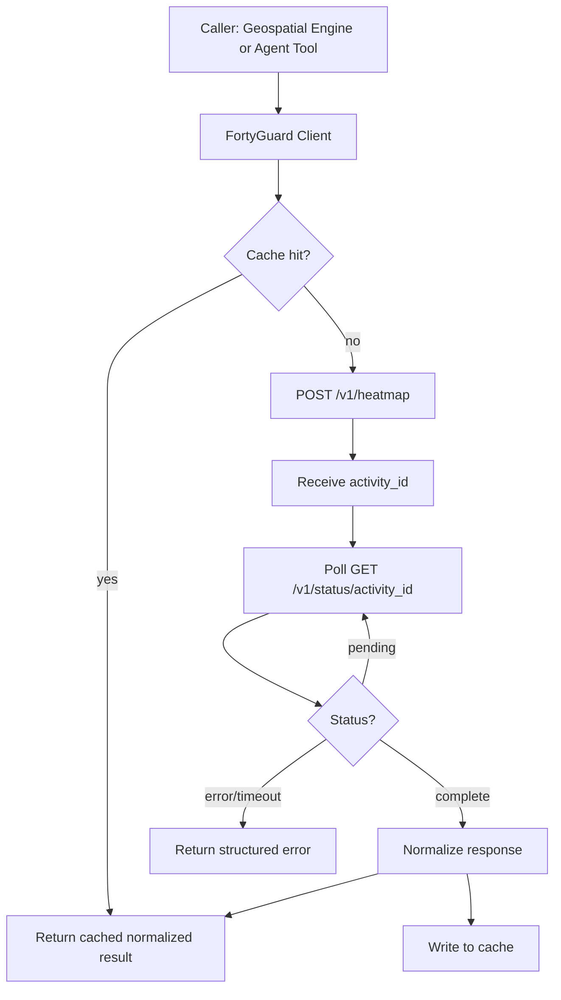

**All FortyGuard access goes through one client module.** No other component calls FortyGuard directly. Responsibilities:

- Builds valid request payloads (`polygon_aoi`, `start_date`, `start_time`, `end_date`, `filter_type`, `granularity`, `analytic_type`, `threshold`, `direction`) with schema validation before submission.
- Enforces `[longitude, latitude]` ordering on every outgoing polygon.
- Submits, then polls `/v1/status/{activity_id}` with exponential backoff and a max poll budget (e.g. 60–90s per AOI for MVP reliability).
- Normalizes FortyGuard's `tcm` / `exceedance` / `persistence` / `time_of_measure` outputs into one internal `HeatObservation`/`HeatMetric` shape, so downstream code never branches on FortyGuard's raw response format.
- Writes/reads the Cache Layer using the key defined in §19.
- Emits observability events at each stage (submitted, activity_id received, polled, completed/failed).
- Never invokes `/env_params`, `/satellite`, `/streetview`, `/heat_intelligence` on the required path — these are optional enrichment hooks behind a feature flag, called only if time and tier permit.

---

## 10. Geospatial Architecture

### 10.1 AOI tiling under the 10 mi² constraint

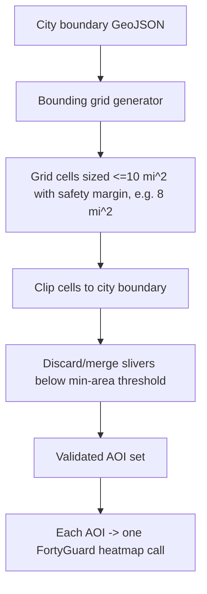

- **Phoenix** (~518 mi²) is covered by a regular grid of AOI tiles sized conservatively under the 10 mi² cap (e.g. ~8 mi² per tile to leave margin for irregular polygon clipping), producing on the order of 60–70 candidate tiles. For the 6-day MVP, the coarse scan targets a **bounded demo region** (a configured sub-area of Phoenix — e.g. a metro core bounding box) rather than the full city, to keep FortyGuard call volume, polling time, and cost predictable during development and live demo. Full-city coverage is a stretch goal, not a blocking requirement.
- **NYC** reuses the identical tiling function with NYC's boundary polygon — this is why one reusable geospatial engine (not two apps) matters.
- Each grid cell is clipped against the actual city boundary polygon (via standard polygon intersection) so we don't waste calls on tiles that are mostly outside the city.
- Cells with clipped area below a minimum threshold are merged into an adjacent cell rather than issued as a separate, wasteful FortyGuard call.

### 10.2 Adaptive refinement (not new resolution)

Refinement narrows the **polygon**, not the thermal grid. FortyGuard's finest native tile is 60m regardless of how small the requested polygon is. Refinement is valuable because it:
- Lets the agent request a tighter analytic window around a candidate hotspot (better focus for `exceedance`/`persistence` analytics, which are area+time sensitive).
- Improves aggregation clarity (fewer irrelevant pixels averaged in).
- Enables deeper investigation cost-effectively (smaller polygon = cheaper/faster call).

The architecture explicitly **never claims** a refined AOI produces sub-60m resolution. This is stated directly in evidence text templates so the agent cannot accidentally overclaim.

### 10.3 Invalid geometry protection

- All polygons pass through a validation step (closed ring, non-self-intersecting, correct `[lng, lat]` ordering, minimum vertex count, coordinate bounds sanity check) **before** being sent to FortyGuard.
- Invalid polygons are auto-repaired where trivial (ring closure, coordinate order fix) and otherwise rejected with a structured error rather than sent to the external API.
- Area is computed and checked against the 10 mi² cap **before** submission — the client never relies on FortyGuard to reject an oversized polygon.

### 10.4 Spatial joins / point-in-polygon / distance

- **Population & vulnerability data → AOI**: census tract/block-group geometries are joined to each AOI via polygon intersection with area-weighted apportionment (a tract straddling two AOIs contributes population proportional to overlap area).
- **Resources → AOI**: cooling centers/hospitals/parks are joined via point-in-polygon for "inside AOI" and via distance calculation (haversine) for "nearest resource / resource coverage radius" when no resource falls inside the AOI itself.
- **Resource coverage**: computed as count of resources within a configurable buffer radius of the AOI centroid, used as an input to Resource Deficit.

---

## 11. Phoenix Data Architecture

| Source | Data | Integration Notes |
|---|---|---|
| Census / ACS | Total population, elderly population %, socioeconomic indicators (poverty rate, income) | Pulled per tract/block group, area-weighted join into AOIs; cached locally as a static dataset refreshed rarely (ACS updates infrequently) |
| MAG Heat Relief Network | Cooling/hydration/respite site locations | Loaded as a resource dataset; refreshed per hackathon prep, not per run |
| ASU Resilience GIS | Supplemental cooling-center geospatial data | Optional enrichment merged into the resource dataset if schema-compatible |
| Maricopa County | Heat-related death data | Used only for **contextual narrative** (e.g., "this area falls within a historically higher heat-mortality zone"), never as a direct scoring input, to avoid conflating this with a medical/mortality index |

All external Phoenix datasets are loaded through a common `DatasetAdapter` interface (see §25) so new sources can be added by writing one adapter, not touching the scoring engine.

---

## 12. NYC Validation Architecture

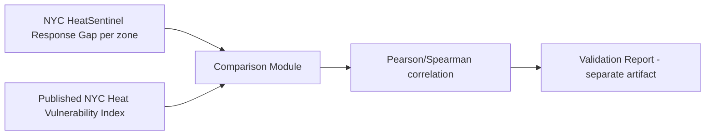

- Runs through the **same** pipeline as Phoenix (same tiling, same scoring engine, same agent) with `city=NYC` config.
- The Validation Report is a distinct, optional output (its own DB table / API route), generated **after** a completed NYC Heat Hunt — it never gates or blocks the Phoenix production path, and Phoenix demo reliability has zero dependency on this module existing or succeeding.
- If time runs out, NYC validation is simply not executed; the architecture supports it without requiring it (see §26–27).

---

## 13. Correlation Architecture

- Independent **Correlation Engine** module, callable on any completed Heat Hunt's AOI-level metric table.
- Computes **Pearson** (linear) and **Spearman** (rank/monotonic) correlation coefficients between pairs such as: heat exposure ↔ population density, heat exposure ↔ elderly %, heat exposure ↔ socioeconomic index, and (if tree-canopy data is available) tree canopy ↔ heat exposure.
- Output: `CorrelationResult { variable_a, variable_b, method, coefficient, p_value?, n }`, stored and surfaced in the UI as a small stats panel — explicitly labeled as **correlation, not causation**, both in the UI copy and in any agent-generated narrative referencing it.
- This module is intentionally decoupled from the Scoring Engine: correlation results **inform** analysis/communication but are **not** fed back into the Response Gap formula for the MVP (keeps the scoring pipeline simple, transparent, and free of circular statistical dependencies).

---

## 14. Agent Philosophy — Reference Diagram

*(Restated here per spec structure; see §7 for full detail.)*

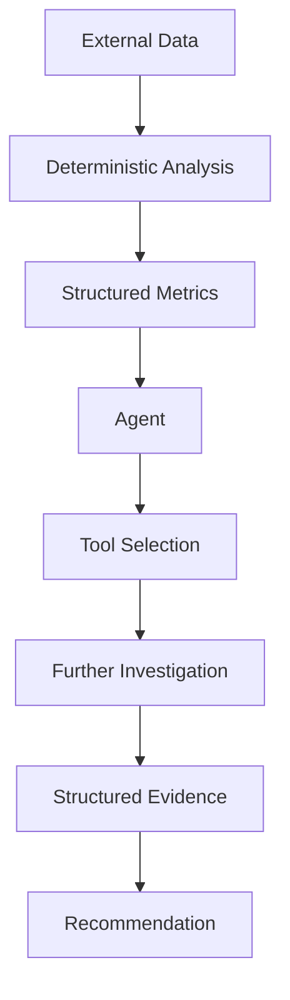

---

## 15. Response Gap / Scoring Architecture

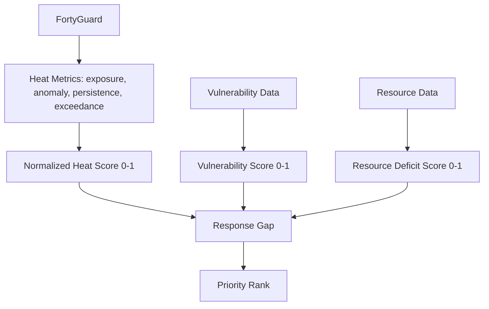

### 15.1 Scoring config (centralized, versioned)

A single `scoring_config` object (stored, versioned, and passed with every run) holds:

```text
scoring_config:
  version: "1.0.0"
  heat:
    weights: { exposure: 0.4, anomaly: 0.3, persistence: 0.2, exceedance: 0.1 }
    normalization: "min-max per-run" | "fixed-range"
  vulnerability:
    weights: { elderly_pct: 0.3, density: 0.2, socio_index: 0.35, ac_access_proxy: 0.15 }
  resource_deficit:
    method: "inverse coverage count within radius"
    radius_km: 1.5
  response_gap:
    formula: "heat_score * vulnerability_score * resource_deficit_score"
    rank_method: "descending response_gap"
```

- **No weight is hardcoded inline in application code** — every scoring function reads from this config object, which is itself a persisted, versioned record (`ScoringConfigVersion`), so a given `HeatHuntRun` always references the exact config version used to produce it (reproducibility requirement).
- Normalization choice (min-max within the run vs. fixed absolute ranges) is a deliberate, documented trade-off:
  - *Min-max per-run*: always produces a visually spread ranking, easy to demo, but zone rankings are relative to that run's data only.
  - *Fixed-range*: comparable across runs/cities, but risks a flat-looking map if the demo region has uniformly extreme heat.
  - **Recommendation for MVP: min-max per-run**, since hackathon demo clarity (a clearly differentiated priority map) outweighs cross-run comparability. This is explicitly configurable so it can be flipped without code changes.
- **Response Gap formula choice**: multiplicative (`heat × vulnerability × resource_deficit`) vs. additive/weighted-sum was considered. Multiplicative is chosen because it correctly represents that **all three factors must be simultaneously present** for a true response gap (extreme heat in a well-resourced, low-vulnerability area should not rank as high as extreme heat in an underserved, high-vulnerability area) — an additive model would let a very high single factor dominate regardless of the other two. **Recommendation: multiplicative, each sub-score normalized to [0,1] first** to keep the product interpretable.

---

## 16. Data Architecture

### 16.1 Layered data model

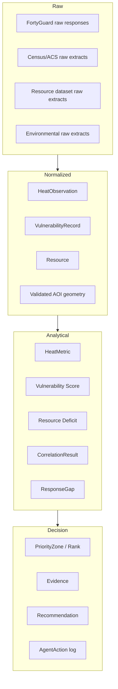

- **Raw data** is kept only as long as needed to normalize it (short-lived cache/scratch, not permanently persisted in full — avoids storing redundant large payloads per the spec's storage guidance). FortyGuard raw JSON is cached (see §19) but not duplicated into the permanent DB beyond what's needed to reproduce results.
- **Normalized data** is the first persisted layer: consistent geographic (GeoJSON, `[lng, lat]`), temporal (UTC ISO-8601), and unit conventions across all sources.
- **Analytical data** is the deterministic engine's output — always derivable from normalized data + scoring config, so it is safe to recompute/version.
- **Decision data** is what the UI and agent narrative consume directly.

---

## 17. Database / Storage Design

### 17.1 Entity classification

| Entity | Persistence |
|---|---|
| `HeatHuntRun` | Persistent |
| `AOI` | Persistent |
| `HeatObservation` (normalized FortyGuard result) | Persistent (lightweight — aggregated, not full raster) |
| `HeatMetric` | Persistent |
| `VulnerabilityRecord` | Persistent (mostly static reference data, low write volume) |
| `Resource` | Persistent (static reference data) |
| `PriorityZone` | Persistent |
| `ResponseGap` | Persistent |
| `Evidence` | Persistent |
| `AgentAction` | Persistent (append-only log) |
| `Recommendation` | Persistent |
| `CorrelationResult` | Persistent |
| `ScoringConfigVersion` | Persistent |
| Raw FortyGuard payloads | **Cached only**, not permanently stored |

### 17.2 ER Diagram

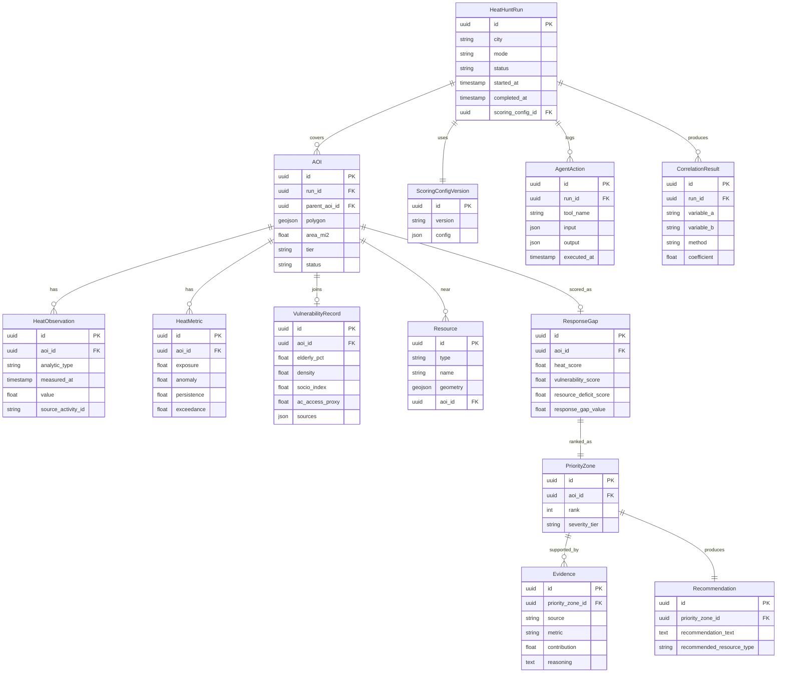

---

## 18. API Architecture (Internal Backend APIs)

| Method | Endpoint | Input | Output | Purpose |
|---|---|---|---|---|
| POST | `/api/heat-hunts` | `{city, mode: live/cached/demo}` | `{run_id, status}` | Start a Heat Hunt |
| GET | `/api/heat-hunts/{run_id}` | — | `{status, phase, progress}` | Poll run status/phase |
| GET | `/api/heat-hunts/{run_id}/zones` | — | `{priority_zones: [...]}` | Ranked results for map/panel |
| GET | `/api/heat-hunts/{run_id}/zones/{zone_id}/evidence` | — | `{evidence[], recommendation}` | Evidence panel data |
| GET | `/api/heat-hunts/{run_id}/agent-log` | — | `{agent_actions[]}` | Agent activity feed |
| GET | `/api/heat-hunts/{run_id}/correlations` | — | `{correlation_results[]}` | Correlation panel |
| GET | `/api/cities/{city}/config` | — | `{boundary, default_aois, resources_summary}` | City metadata for map init |
| POST | `/api/heat-hunts/{run_id}/cancel` | — | `{status}` | Abort a stuck run |
| GET | `/api/scoring-configs/{version}` | — | `{config}` | Transparency: view exact weights used |
| GET | `/api/nyc-validation/{run_id}` | — | `{validation_report}` | Optional NYC validation output |

All endpoints are read via polling for the MVP (simplest reliable option for a 6-day build); a WebSocket/SSE stream for live phase updates is a "should have," not a "must have" (see §27).

---

## 19. Frontend Architecture

### 19.1 Component hierarchy

```text
<App>
 └─ <CommandCenter>
     ├─ <HeatHuntControl>          (RUN HEAT HUNT button + mode selector: live/cached/demo)
     ├─ <GlobalStatusBar>          (critical/high/moderate/low zone counts)
     ├─ <MapPanel>
     │   ├─ <HeatLayer>            (FortyGuard heat rendering)
     │   ├─ <PriorityZoneLayer>
     │   ├─ <SelectedAOIOverlay>
     │   ├─ <RefinedHotspotOverlay>
     │   └─ <ResourceMarkers>
     ├─ <PriorityPanel>
     │   └─ <ZoneCard> (temperature, persistence, exceedance, anomaly, vulnerability, resources, response gap, recommendation)
     ├─ <EvidencePanel>
     │   └─ <EvidenceRow> (source, metric, contribution, reasoning)
     ├─ <AgentActivityFeed>
     │   └─ <ToolCallEntry> (tool name, input summary, status, timestamp)
     └─ <CorrelationPanel>        (optional stretch)
```

### 19.2 Data binding
Each panel subscribes to a slice of the run state fetched via the polling endpoints in §18 — no panel talks to FortyGuard or any external source directly; everything comes through the backend's normalized/decision-layer data.

---

## 20. State Management

| Layer | State Owner | Notes |
|---|---|---|
| Frontend | React state/query cache per run_id | Polls backend; no independent business logic; purely presentational |
| Backend/Orchestrator | `HeatHuntRun.status` + `phase` (source of truth) | The authoritative state machine (§21) |
| Agent | Ephemeral, scoped to one run, held by Orchestrator context object | Not stored in LLM conversational memory; reconstructed from `investigated_aois`, `pending_aois`, `evidence` each turn |
| Database | Persisted final + intermediate state | Enables run replay/debugging and demo-mode reuse |

---

## 21. Background Jobs — Heat Hunt State Machine

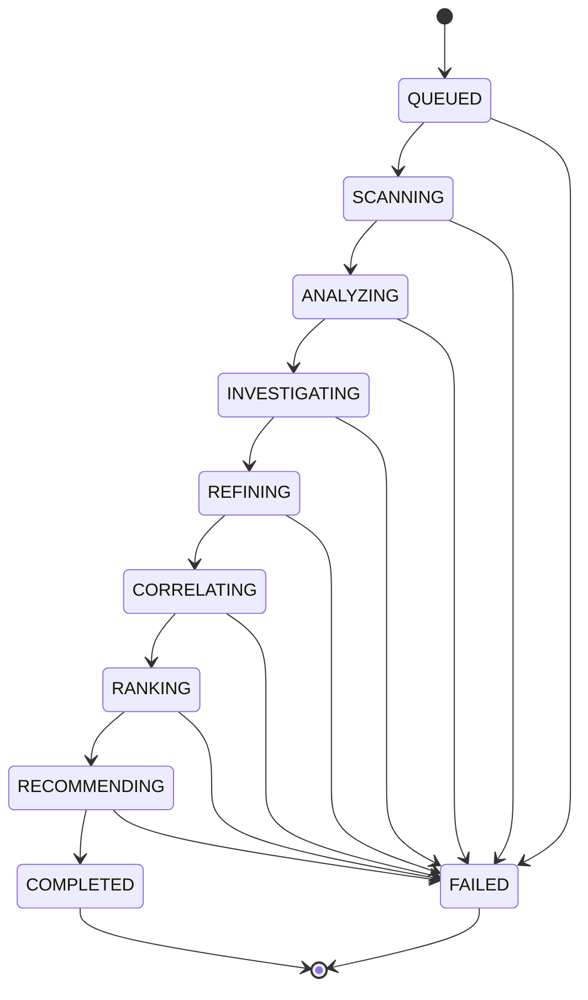

- Executed by a single in-process job orchestrator (e.g. an async task/worker within the monolith) — no external job queue infrastructure needed at this scale (Redis-backed queue is a "should have" only if concurrency across multiple simultaneous runs becomes necessary; **not required** for a single-demo-run-at-a-time hackathon MVP).
- `CORRELATING` is skippable (flagged optional) without failing the run — if correlation fails or is skipped, `RANKING` proceeds independently, since the Correlation Engine output does not feed Response Gap (§13).
- Every phase transition is logged with the `run_id` as correlation ID (§23), and the frontend polls `/api/heat-hunts/{run_id}` to reflect the current phase.

---

## 22. Caching Architecture

### 22.1 Cache key

```text
cache_key = hash(
  polygon_aoi_normalized,   # canonicalized coordinate order + rounding
  start_date,
  start_time,
  end_date?,
  analytic_type,
  granularity,
  threshold?,
  direction?
)
```

- Polygon is canonicalized (consistent vertex order, coordinate rounding to a fixed precision) before hashing so trivially-equivalent polygons hit the same cache entry.
- Cache entries store the **normalized** FortyGuard result plus metadata: `{source: "fortyguard", fetched_at, activity_id, cache_key}` — always tagged so downstream consumers and the UI can distinguish a fresh call from a cache hit (feeds Demo Mode transparency, §24).
- **Recommendation for MVP:** in-process/local key-value cache (e.g. simple TTL dict or SQLite-backed cache table) rather than standing up Redis — one less moving part for a 3-person team in 6 days, acceptable given single-instance deployment (§23). Upgrading to Redis later requires no interface change since the cache is accessed through one `CacheClient` abstraction.
- TTL: heat data cache entries expire on a configurable window (e.g. 24h) since FortyGuard reflects recent/historical observations, not something that changes minute-to-minute for demo purposes.

---

## 23. Error Handling

| Failure | Handling |
|---|---|
| FortyGuard timeout | Mark AOI `DATA_UNAVAILABLE`; run continues with remaining AOIs; UI shows "data unavailable" for that zone, never a fabricated value |
| FortyGuard API error (4xx/5xx) | Structured error captured with status code; retried once with backoff for 5xx, not retried for 4xx (likely a bad request needing code fix) |
| Invalid polygon | Caught pre-submission by geospatial validation (§10.3); request never reaches FortyGuard |
| Missing vulnerability data | `VulnerabilityRecord` fields nullable; Vulnerability Score computation flags `partial_data: true`; explicitly surfaced in Evidence panel, never silently defaulted to an assumed value |
| Missing resource data | Distinguish "confirmed zero resources" from "dataset fetch failed" — only the latter is an error state |
| Malformed external dataset | Row-level validation on ingest; malformed rows skipped and counted, not silently dropped without a log entry |
| LLM failure (API error / malformed tool call) | Retry once; on repeated failure, run proceeds with deterministic-only output and a flagged "narrative unavailable" state rather than blocking the whole Heat Hunt |
| Tool failure (any) | Logged as `AgentAction` with `status: failed`; orchestrator decides whether the run can proceed in degraded mode or must fail the phase |
| Partial Heat Hunt completion | A run can complete as `COMPLETED_PARTIAL` if some AOIs/tools failed but a usable ranked subset exists — this state is explicit, not hidden |

**Guiding rule (per spec):** the system never fabricates data to fill a gap. Every gap is a visible, labeled gap.

---

## 24. Security Architecture

- All external API keys (FortyGuard, census data provider if key-gated, etc.) live in backend-only environment variables (`.env`, never committed — `.gitignore` includes `.env`); an `.env.example` documents required variable names with placeholder values.
- The FortyGuard client is the **only** module with network access to `api.fortyguard.com`; it is never reachable from frontend code, and no key or credential is ever included in any frontend bundle or API response.
- All inbound API requests validate input shape/types before touching the geospatial or FortyGuard layers (prevents malformed polygons or injection-style payloads from propagating).
- External API responses are treated as untrusted input and schema-validated before normalization.
- Logging sanitizes error messages before they reach the frontend — internal stack traces/keys are never included in API error responses; only a safe, user-facing message and an internal correlation/run ID are returned.

---

## 25. Observability

Logged events, each tagged with the `run_id` as a correlation ID so a full Heat Hunt is traceable end-to-end:

```text
heat_hunt.started
aoi.submitted
fortyguard.activity_id_received
fortyguard.completed
fortyguard.failed
cache.hit
cache.miss
agent.tool_selected
agent.tool_completed
agent.tool_failed
polygon.refined
score.calculated
correlation.calculated
recommendation.generated
heat_hunt.completed
heat_hunt.failed
```

- Structured (JSON) logs, one line per event, minimum fields: `timestamp, run_id, event, aoi_id?, tool_name?, duration_ms?, status`.
- For the MVP, logs to stdout/file is sufficient (no dedicated logging infrastructure needed); the `run_id` is the join key that lets a judge/developer reconstruct the full story of a run after the fact — useful both for debugging and for post-hoc "show your work" demo narration.

### 25.1 Dataset extensibility

New external datasets (e.g. a future tree-canopy layer) are added by implementing one `DatasetAdapter` interface (`fetch(aoi) -> NormalizedRecord`) and registering it — the Deterministic Analysis Engine and Scoring Engine consume normalized records generically and require no changes to accommodate a new source.

---

## 26. Deployment Architecture

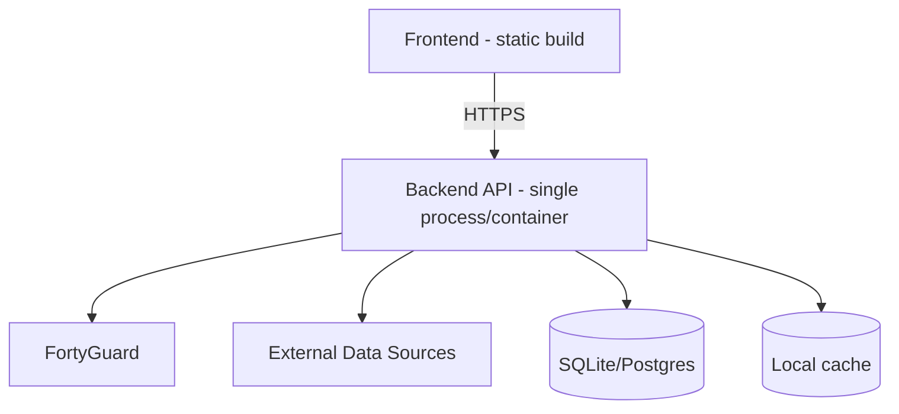

- **Recommendation:** single backend process (containerized, e.g. one Docker image) + a static-hosted frontend build, deployed to one simple platform (e.g. a single VM, Render/Fly/Railway-style PaaS, or even a laptop for the live demo with a cloud fallback). This avoids Kubernetes, multi-region, and service-mesh complexity entirely, per the explicit spec constraint.
- **Database:** SQLite is sufficient for the demo's data volume and simplifies zero-ops deployment; Postgres is a drop-in upgrade if the team wants stronger concurrent-write guarantees — the persistence layer is accessed through a single data-access module so this swap doesn't ripple through the codebase.
- No queue infrastructure, no service mesh, no separate cache server required at MVP scale (§22).

---

## 27. Demo Mode Architecture

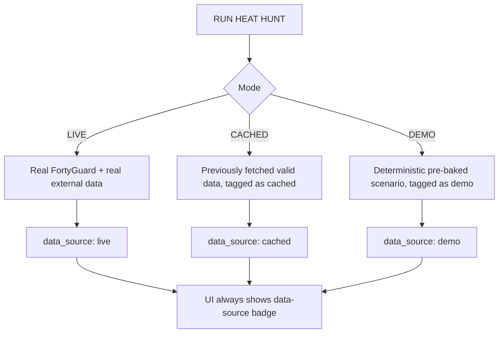

- Every `HeatHuntRun` and every `HeatObservation` carries an explicit `data_source` field (`live | cached | demo`), set at write time and **never inferred or overridden downstream** — this is the mechanism that makes it structurally impossible to mislabel demo data as live.
- The UI renders a persistent, visible badge reflecting `data_source` for the active run — judges always see which mode produced what they're looking at.
- **DEMO mode** uses a fixed, version-controlled scenario dataset (pre-baked FortyGuard-shaped results + real Phoenix vulnerability/resource data) so the demo path has zero external dependency and zero network risk during judging — this is the primary reliability safeguard against live-demo failure.
- **CACHED mode** replays the most recent successful LIVE run's cache entries — useful for rehearsal without burning API quota, still clearly labeled as not-live.

---

## 28. Phoenix Implementation Scope

**Built for Phoenix (MVP):**
- Full pipeline: scan → detect → investigate → refine → score → rank → explain → recommend, over a bounded demo sub-region of Phoenix (configurable bounding box within full city limits).
- FortyGuard `tcm`, `exceedance`, `persistence` analytic types (native, not rebuilt).
- Census/ACS vulnerability data, MAG Heat Relief Network + ASU resource data.
- Response Gap scoring, ranking, evidence, recommendations.
- Live / Cached / Demo modes, all fully wired for Phoenix.
- Full Command Center UI for Phoenix.

**Explicitly optional/stretch for Phoenix:**
- Full-city (all ~518 mi²) coverage vs. bounded demo region.
- Maricopa County heat-death contextual narrative.
- `/env_params`, `/satellite`, `/streetview`, `/heat_intelligence` enrichment calls.

---

## 29. NYC Validation Scope

**Optional, non-blocking:**
- Reuse of the same pipeline with `city=NYC` config and NYC boundary/tiling.
- Comparison of HeatSentinel Response Gap output against the published NYC Heat Vulnerability Index.
- Pearson/Spearman correlation between the two.
- A standalone Validation Report view.

**Explicitly not required:** NYC does not need its own Command Center polish, its own resource dataset beyond what's needed for the comparison, or live-demo reliability guarantees — it exists to demonstrate methodological credibility (useful for "Technical Execution" and "Innovation" judging) if time permits after Phoenix is solid.

---

## 30. MVP vs. Optional

**MUST HAVE**
- FortyGuard client (submit/poll/normalize/cache) for `/v1/heatmap` + `/v1/status`.
- AOI tiling under 10 mi² for a bounded Phoenix demo region.
- Deterministic heat metrics (exposure, anomaly using current-vs-historical baseline, native persistence/exceedance consumption).
- Vulnerability + resource data integration (Census/ACS, MAG) for the demo region.
- Response Gap scoring engine, config-driven, versioned.
- Real agentic tool loop (scan → select → refine → score → explain → recommend) with logged `AgentAction`s.
- Command Center UI: map, priority panel, evidence panel, agent activity feed, `RUN HEAT HUNT` control.
- Live / Cached / Demo modes with visible data-source labeling.
- Basic error handling/graceful degradation as in §23.
- `.env`-based key security.

**SHOULD HAVE**
- Correlation Engine (Pearson/Spearman) panel.
- ASU Resilience GIS enrichment.
- SSE/WebSocket live progress instead of polling.
- Full-Phoenix (not just bounded region) tiling.

**NICE TO HAVE**
- NYC validation pipeline + report.
- `/env_params`, `/satellite`, `/streetview`, `/heat_intelligence` enrichment.
- Maricopa County contextual heat-death narrative.
- Postgres/Redis upgrade path exercised (vs. left as a documented option).

**DO NOT BUILD**
- Forecasting of any kind.
- ML model training/fine-tuning.
- Microservices / Kubernetes / multi-region deployment.
- LLM-performed arithmetic feeding into Response Gap.
- Any feature requiring FortyGuard premium tier for the core product to function.

---

## 31. Team Ownership

| Component | AI Engineer | Backend Engineer | Frontend Engineer | Project Manager (shared) |
|---|---|---|---|---|
| FortyGuard client | | ✅ | | |
| Geospatial engine (tiling, validation, joins) | | ✅ | | |
| Deterministic analysis engine | | ✅ | | |
| Scoring engine + config | | ✅ | | Reviews weight config |
| Correlation engine | | ✅ (or shared) | | |
| Agent loop + tool orchestration | ✅ | | | |
| Tool prompt design / evidence & recommendation generation | ✅ | | | |
| Job orchestrator / state machine | | ✅ | | |
| Cache layer | | ✅ | | |
| Storage / ER schema | | ✅ | | |
| Internal API layer | | ✅ | | |
| Command Center UI (all panels) | | | ✅ | |
| Map + heat/resource layers | | | ✅ | |
| Agent activity feed rendering | | | ✅ (consumes AI Eng.'s log schema) | |
| Demo/Cached/Live mode UI + badge | | | ✅ | |
| Scenario data curation for Demo Mode | ✅ (evidence/recs) | ✅ (metrics) | | ✅ (coordinates) |
| Run-tracking / observability | | ✅ | | Reviews logs before demo |
| Overall integration, timeline, demo script | | | | ✅ |

---

## 32. Six-Day Architecture Roadmap

*(Numbered per spec's "29" but tracking this document's own section flow — see note below.)*

| Day | Backend | AI Engineer | Frontend |
|---|---|---|---|
| **1** | FortyGuard client (submit/poll/normalize), city boundary + tiling function, cache layer skeleton | Define tool interfaces/schemas, agent scaffolding, prompt drafts | Command Center shell, map integration, `RUN HEAT HUNT` button wired to a stub API |
| **2** | Deterministic heat metrics (exposure/anomaly/baseline), persistence/exceedance normalization | Wire `scan_city`/`query_fortyguard_heat` tool calls against real client | Map heat layer rendering from real/mocked data |
| **3** | Vulnerability + resource data ingestion (Census/ACS, MAG), spatial joins | Wire `refine_hotspot`, `get_vulnerability_data`, `get_resources` | Priority panel + zone cards |
| **4** | Scoring engine (Response Gap), config schema, ranking | Wire `calculate_risk_metrics`, `calculate_response_gap`; begin `explain_priority` prompt tuning | Evidence panel; agent activity feed wired to real `AgentAction` log |
| **5** | Job orchestrator state machine end-to-end; error handling/degradation paths; Demo Mode dataset finalized | `recommend_action` finalized; full agent loop run end-to-end on real Phoenix demo region | Full Command Center integration pass; Live/Cached/Demo mode UI + badges |
| **6** | Bug fixes, observability pass, deployment | Prompt polish, evidence/recommendation quality pass, NYC stretch if time allows | Visual polish, demo rehearsal, fallback rehearsal (network-down scenario) |

Note: the spec's outline numbers this "Section 29"; it is placed here as §32 to keep this document's own internal numbering consistent, and covers the same content requested.

---

## 33. Architecture Risks

| Risk | Mitigation |
|---|---|
| FortyGuard latency/rate limits make a full scan too slow for a live demo | Bounded demo region (§28) + aggressive caching (§22) + Demo Mode as the guaranteed judging path (§27) |
| 10 mi² tiling produces too many calls for the time budget | Conservative sub-8 mi² tiles only over the bounded demo region, not full Phoenix, for MVP |
| Agent hallucinating evidence not grounded in structured data | `explain_priority`/`recommend_action` prompts constrained to cite only fields present in the passed structured evidence object; validated by the AI engineer with spot-checks against source data |
| Missing/incomplete external datasets (Census, MAG, ASU) close to demo day | Data ingestion prioritized Day 1–3; explicit `missing_evidence` flag support (§23) means partial data degrades gracefully rather than breaking the run |
| Scope creep toward two separate apps for Phoenix/NYC | Single reusable pipeline enforced from Day 1 by parameterizing city config, never hardcoding Phoenix-only logic |
| Team members blocking each other (backend/agent/frontend contracts unstable) | API schemas (§18) and tool I/O schemas (§8) locked by end of Day 1, treated as the interface contract for the rest of the build |
| Live demo network failure | Demo Mode (§27) requires zero external network calls and is rehearsed as the default fallback |
| Response Gap weights feel arbitrary/opaque to judges | Centralized, versioned, inspectable `scoring_config` (§15, §18 `/api/scoring-configs/{version}`) makes the formula and weights explicitly presentable |

---

## 34. Definition of Done (Technical Acceptance Criteria)

A Heat Hunt run for Phoenix is considered functionally complete when:

1. `RUN HEAT HUNT` triggers a real job that transitions through the full state machine (§21) and reaches `COMPLETED` or `COMPLETED_PARTIAL`.
2. At least the bounded Phoenix demo region has been tiled, submitted to FortyGuard, polled, and normalized into `HeatObservation`/`HeatMetric` records.
3. At least one hotspot has been genuinely refined via a real `refine_hotspot` → FortyGuard round trip (not a scripted/faked step).
4. Vulnerability and resource data are joined into the investigated AOIs, with any gaps explicitly flagged rather than fabricated.
5. Response Gap is computed via the versioned, config-driven Scoring Engine and produces a ranked `PriorityZone` list.
6. Evidence and Recommendation text are generated by the agent, grounded only in structured evidence, and viewable per zone.
7. The Agent Activity feed reflects the actual sequence of tool calls executed for that run (verifiable against the `AgentAction` log).
8. The Command Center UI displays: global status counts, map with heat/priority/resource layers, priority panel, evidence panel, and agent activity feed, all sourced from the backend APIs in §18.
9. Live, Cached, and Demo modes all function, and the active mode is visibly labeled in the UI at all times.
10. No FortyGuard or other external API key is present in any frontend-reachable code or network response.
11. A full run is traceable end-to-end via its `run_id` across logs (§25).
12. The identical pipeline can be pointed at NYC via config alone, with no Phoenix-specific code path required to change (even if the NYC validation report itself is not completed).

---

## Final Recommended Architecture (Summary)

- **Pattern:** Modular monolith, single deployable backend, static frontend build.
- **Core data path:** FortyGuard → Geospatial tiling (bounded Phoenix demo region, sub-8 mi² tiles) → Deterministic Analysis Engine → versioned Scoring Engine (multiplicative Response Gap) → Agent (tool-driven investigation + narrative only) → Command Center UI.
- **Storage:** SQLite (Postgres-compatible data-access layer for easy upgrade).
- **Cache:** in-process/local key-value cache keyed on canonicalized AOI + temporal + analytic parameters.
- **Jobs:** in-process async orchestrator with an explicit state machine, polled by the frontend.
- **Reliability:** Demo Mode with zero external dependencies as the guaranteed judging path; Live and Cached modes clearly, structurally distinguished via a `data_source` field that cannot be overridden downstream.
- **Reuse:** one pipeline, parameterized by city config, serving both Phoenix (primary) and NYC (optional validation) without architectural forking.

This architecture is the baseline that all subsequent Antigravity implementation prompts should follow without requiring redesign.
